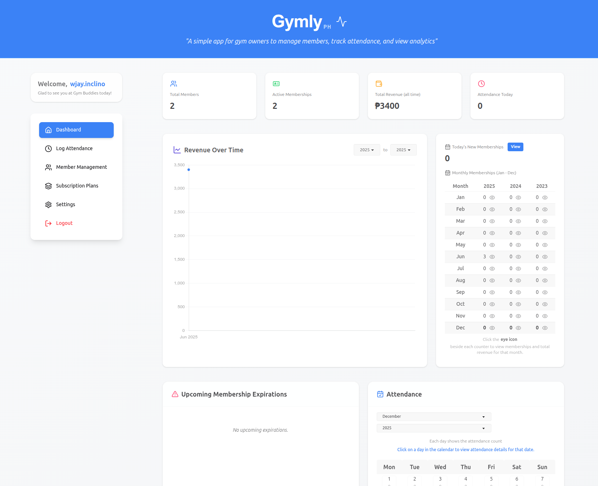
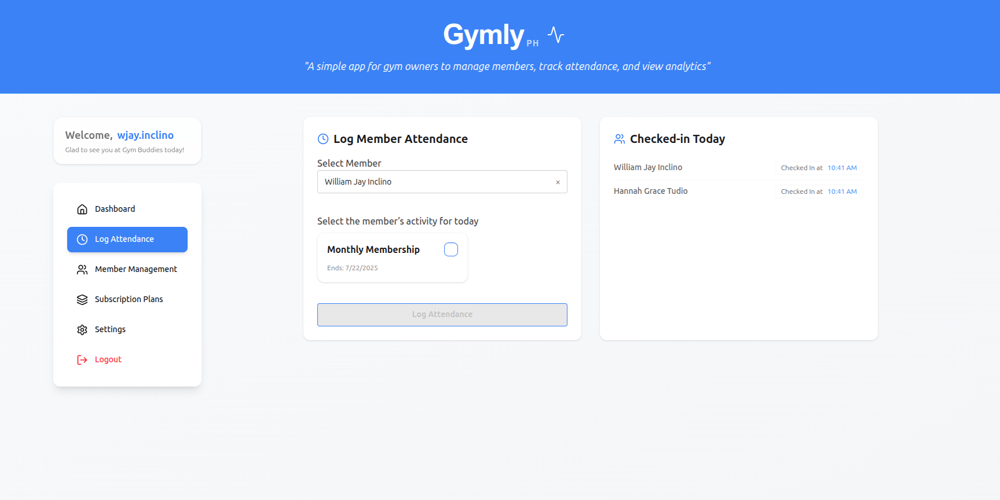
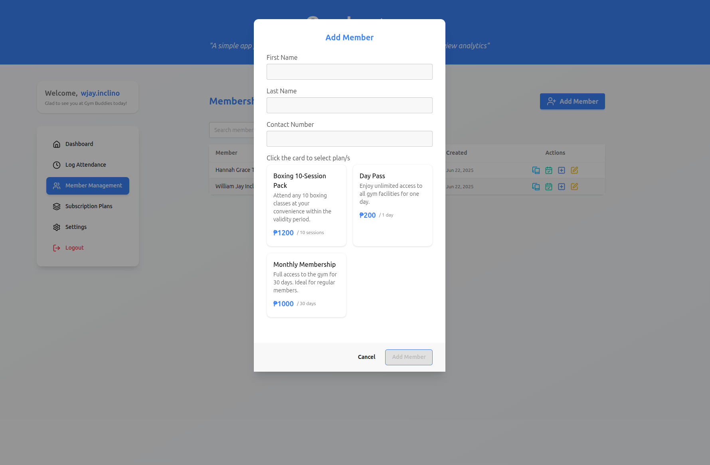
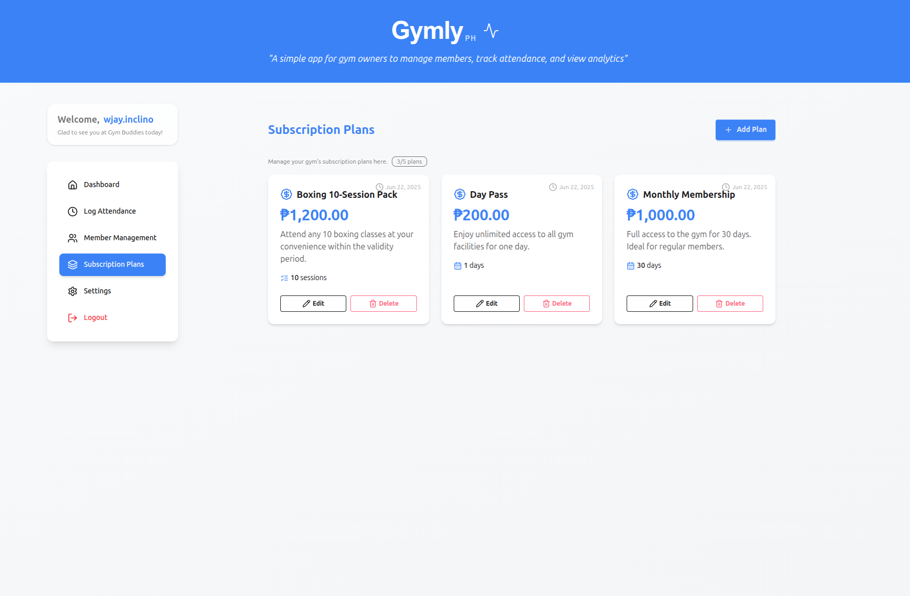
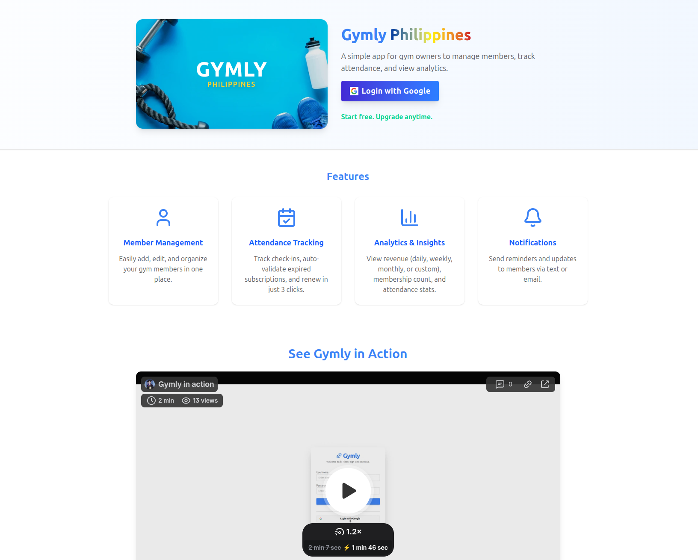
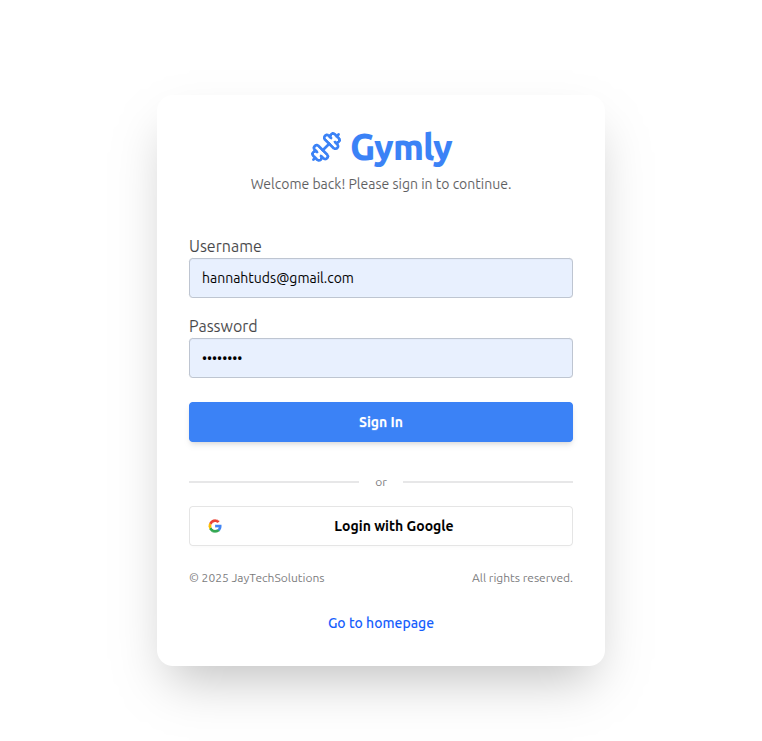

<div align="center">
  <h1>🏋️ Gymly PH</h1>
  <p><strong>A Modern Gym Management System</strong></p>
  <p>Streamline your fitness business with powerful member management, attendance tracking, and real-time analytics.</p>
  
  <h3>🌐 <a href="https://jaytechsolutions.cloud/gymly/" target="_blank">View Live Demo</a></h3>
  
  <p>
    
    
    
    
  </p>
</div>

---

## 📋 Overview

**Gymly PH** is a comprehensive gym management solution designed to help fitness center owners efficiently manage their operations. Built with modern technologies and a focus on user experience, it provides real-time insights into member activity, revenue tracking, and subscription management.

## ✨ Key Features

### 📊 **Dashboard Analytics**
- **Real-time Metrics**: Track total members, active memberships, lifetime revenue, and daily attendance at a glance
- **Revenue Visualization**: Interactive line graphs powered by Chart.js showing revenue trends over time
- **Membership Insights**: Monitor new memberships, monthly subscription patterns, and upcoming expirations
- **Attendance Calendar**: Visual representation of gym activity throughout the month



### ✅ **Attendance Tracking**
- **Quick Check-in**: Fast and intuitive member attendance logging system
- **Recent Activity**: Real-time view of today's checked-in members
- **Historical Records**: Comprehensive attendance history for analysis



### 👥 **Member Management**
- **Complete Member Profiles**: Store and manage detailed member information
- **Membership Status**: Track active, expired, and upcoming renewals
- **Search & Filter**: Quickly find members with powerful search capabilities
- **Member History**: View complete membership and attendance history



### 💳 **Subscription Plans**
- **Flexible Plans**: Create and manage multiple subscription tiers
- **Custom Pricing**: Set different pricing models to suit your business needs
- **Plan Analytics**: Track which plans are most popular



### 🏠 **Landing Page**
- **Modern Design**: Clean and professional interface for first impressions
- **Responsive Layout**: Optimized for all devices



### 🔐 **Secure Authentication**
- **User Authentication**: Secure login system for gym staff and administrators



---

## 🛠️ Technology Stack

### **Frontend**
- **Nuxt.js 3** - Vue.js framework for building modern web applications
- **TypeScript** - Type-safe development
- **Tailwind CSS** - Utility-first CSS framework
- **Chart.js** - Beautiful, responsive charts and graphs
- **Vue Toastification** - Elegant notifications

### **Backend**
- **NestJS** - Progressive Node.js framework
- **TypeScript** - End-to-end type safety
- **PostgreSQL** - Robust relational database
- **Prisma** - Object-relational mapping
- **JWT** - Secure authentication

### **DevOps & Tools**
- **Docker** - Containerized development environment
- **PM2** - Production process manager
- **pnpm** - Fast, disk space efficient package manager

---

## 🚀 Getting Started

### Prerequisites
- Node.js (v18 or higher)
- pnpm
- PostgreSQL
- Docker (optional)

### Installation

1. **Clone the repository**
```bash
git clone https://github.com/William-Jay-Inclino/gymly.git
cd gymly
```

2. **Install dependencies**
```bash
# Backend
cd backend
pnpm install

# Frontend
cd ../frontend
pnpm install
```

3. **Environment Configuration**
```bash
# Backend - Create .env file
cp backend/_env.temp.txt backend/.env

# Frontend - Create .env file
cp frontend/_env.temp.txt frontend/.env
```

4. **Database Setup**
```bash
# Using Docker
cd backend/docker
docker-compose up -d
```

5. **Start Development Servers**
```bash
# Backend (in backend directory)
pnpm run start:dev

# Frontend (in frontend directory)
pnpm run dev
```

---

## 📁 Project Structure

```
gymly/
├── backend/              # NestJS backend application
│   ├── apps/            # Application modules
│   ├── docker/          # Docker configuration
│   └── scripts/         # Utility scripts
├── frontend/            # Nuxt.js frontend application
│   ├── components/      # Vue components
│   ├── core/           # Core business logic & stores
│   ├── pages/          # Application pages
│   └── middleware/     # Route middleware
├── docs/               # Documentation files
└── readme-screenshots/ # Application screenshots
```

---

## 🎯 Use Cases

- **Gym Owners**: Manage member subscriptions and track business performance
- **Fitness Centers**: Monitor daily attendance and member engagement
- **Personal Trainers**: Track client memberships and session attendance
- **Health Clubs**: Analyze revenue trends and membership patterns

---

## 🔮 Future Enhancements

- [ ] Mobile application (React Native)
- [ ] Email/SMS notifications for membership renewals
- [ ] Payment gateway integration
- [ ] Advanced reporting and export features
- [ ] Multi-gym/branch management
- [ ] Member self-service portal
- [ ] QR code-based check-in system

---

## 👨‍💻 Developer

**William Jay Inclino**

I'm a full-stack developer passionate about building scalable and user-friendly applications. This project demonstrates my expertise in:

- Modern frontend frameworks (Vue.js/Nuxt.js)
- Backend architecture (NestJS)
- Database design and optimization (PostgreSQL)
- RESTful API development
- Authentication & authorization
- Responsive UI/UX design
- Docker containerization

---

## 📞 Contact

- **GitHub**: [@William-Jay-Inclino](https://github.com/William-Jay-Inclino)
- **Email**: [wjay.inclino@gmail.com]
- **LinkedIn**: [https://www.linkedin.com/in/william-jay-inclino-02140022a/]
- **Portfolio**: [https://jaytechsolutions.cloud/portfolio/]

---

## 📄 License

This project is licensed under the MIT License - see the LICENSE file for details.

---

<div align="center">
  <p>⭐ If you find this project interesting, please consider giving it a star!</p>
  <p>Made with ❤️ and lots of ☕</p>
</div>
